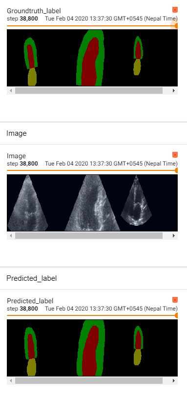
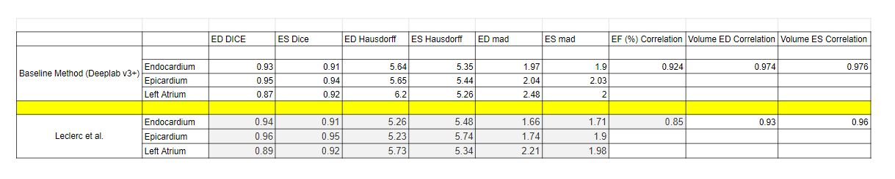

Modelling uncertainty to improve the segmentation for echocardiography. Automatically removed uncertain images to improve State of the Art.  

Three ways to generate samples to model uncertainty : 
1. Monte Carlo Dropout 
2. Horizontal Stacked Ensembles
3. Test Time Augmentation

Four metrics were used to assess uncertainty
a. Entropy b. Variance c. Mutual Information d. Probabilistic Atlas

Pytorch Implementation of Deeplab v3+ Architecture to segment echocardiography images adapted from 
https://github.com/jfzhang95/pytorch-deeplab-xception




### Installation
The code was tested with Anaconda and Python 3.7. After installing the Anaconda environment:

0. Clone the repo:
    ```Shell
    git clone https://github.com/jfzhang95/pytorch-deeplab-xception.git
    cd pytorch-deeplab-xception
    ```

1. Install dependencies:

    For PyTorch dependency, see [pytorch.org](https://pytorch.org/) for more details.

    For custom dependencies:
    ```Shell
    pip install matplotlib pillow tensorboardX tqdm
    ```
### Training
Follow steps below to train your model:

0. Configure your dataset path in [mypath.py](https://github.com/jfzhang95/pytorch-deeplab-xception/blob/master/mypath.py).

1. Input arguments: (see full input arguments via python train.py --help):
    ```Shell
    usage: train.py [-h] [--backbone {resnet,xception,drn,mobilenet}]
                [--out-stride OUT_STRIDE] [--dataset {pascal,coco,cityscapes}]
                [--use-sbd] [--workers N] [--base-size BASE_SIZE]
                [--crop-size CROP_SIZE] [--sync-bn SYNC_BN]
                [--freeze-bn FREEZE_BN] [--loss-type {ce,focal}] [--epochs N]
                [--start_epoch N] [--batch-size N] [--test-batch-size N]
                [--use-balanced-weights] [--lr LR]
                [--lr-scheduler {poly,step,cos}] [--momentum M]
                [--weight-decay M] [--nesterov] [--no-cuda]
                [--gpu-ids GPU_IDS] [--seed S] [--resume RESUME]
                [--checkname CHECKNAME] [--ft] [--eval-interval EVAL_INTERVAL]
                [--no-val]

    ```

2. To train deeplabv3+ using Pascal VOC dataset and ResNet as backbone:
    ```Shell
    bash train_voc.sh
    ```
3. To train deeplabv3+ using COCO dataset and ResNet as backbone:
    ```Shell
    bash train_coco.sh
    ```    

### Acknowledgement
[PyTorch-Encoding](https://github.com/zhanghang1989/PyTorch-Encoding)

[Synchronized-BatchNorm-PyTorch](https://github.com/vacancy/Synchronized-BatchNorm-PyTorch)

[drn](https://github.com/fyu/drn)
